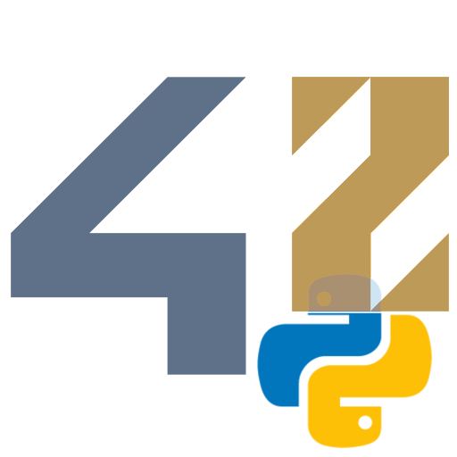

> **⚠️ FORK NOTICE**
>
> This extension is a **specialized fork** of the original [vscode-42header by kube](https://githubcom/kube/vscode-42header).
>
> **Why this fork?** The original extension generates headers that conflict with Python linting rules. This version is explicitly designed for **Python development**, ensuring **Flake8 compliance** and handling Python-specific syntax like Shebangs.


This extension integrates the 42 school header into VS Code, specifically optimized for Python projects.

## Key Differences & Features

Unlike the standard extension, this version provides:

* **Flake8 Compliance**: Generates a "mini-header" format that passes strict Python linter checks.
* **Shebang Support**: Intelligently handles `#!/usr/bin/env python` lines. The header is inserted *after* the shebang (with a spacer line) to preserve script execution.
* **Group Project Support**: Easily override the author field for multiple contributors without changing your global settings.

## Header Preview

```bash
# ************************************************************************* #
#                                                                           #
#                                                      :::      ::::::::    #
#  python_module.py                                  :+:      :+:    :+:    #
#                                                  +:+ +:+         +:+      #
#  By: overtek <overtek@student.42.fr>           +#+  +:+       +#+         #
#                                              +#+#+#+#+#+   +#+            #
#  Created: 2026/01/19 08:57:15 by overtek         #+#    #+#               #
#  Updated: 2026/01/19 09:18:37 by overtek         ###   ########.fr        #
#                                                                           #
# ************************************************************************* #
```

## Install

Launch Quick Open with <kbd>⌘</kbd>+<kbd>P</kbd> and enter
```
ext install 42headerpython
```

## Usage

### Insert a header
 - **macOS** : <kbd>⌘</kbd> + <kbd>⌥</kbd> + <kbd>P</kbd>
 - **Linux** / **Windows** : <kbd>Ctrl</kbd> + <kbd>Alt</kbd> + <kbd>P</kbd>.

## Shebang Handling

If your file starts with a shebang (e.g., `#!/usr/bin/env python`), the header will automatically be placed on the second line, leaving a blank line in between to ensure the script remains executable.


## Configuration

Default values for **username** and **email** are imported from environment variables.

To override these values, specify these properties in *User Settings* :

```ts
{
  "42headerpython.username": string,
  "42headerpython.email": string
}
```

### Group project

Working on a group project? You can override the "By" field to list all members. Create a `.vscode/settings.json` at the root of your project:

```json
{
  "42headerpython.customAuthor": "login1, login2, login3"
}
```

### Header Preview

```bash
# ************************************************************************* #
#                                                                           #
#                                                      :::      ::::::::    #
#  my_super_group_project.py                         :+:      :+:    :+:    #
#                                                  +:+ +:+         +:+      #
#  By: user1, user2, user3                       +#+  +:+       +#+         #
#                                              +#+#+#+#+#+   +#+            #
#  Created: 2026/01/19 08:57:15 by roandrie        #+#    #+#               #
#  Updated: 2026/01/19 09:18:37 by roandrie        ###   ########.fr        #
#                                                                           #
# ************************************************************************* #
```

*(Note: The "Updated By" field remains dynamic to track who actually modified the file).*

## Issues

In case of a bug, or missing feature, please create a [Github Pull Request](https://github.com/Overtekk/vscode-42header-python/pulls).

## License

MIT
